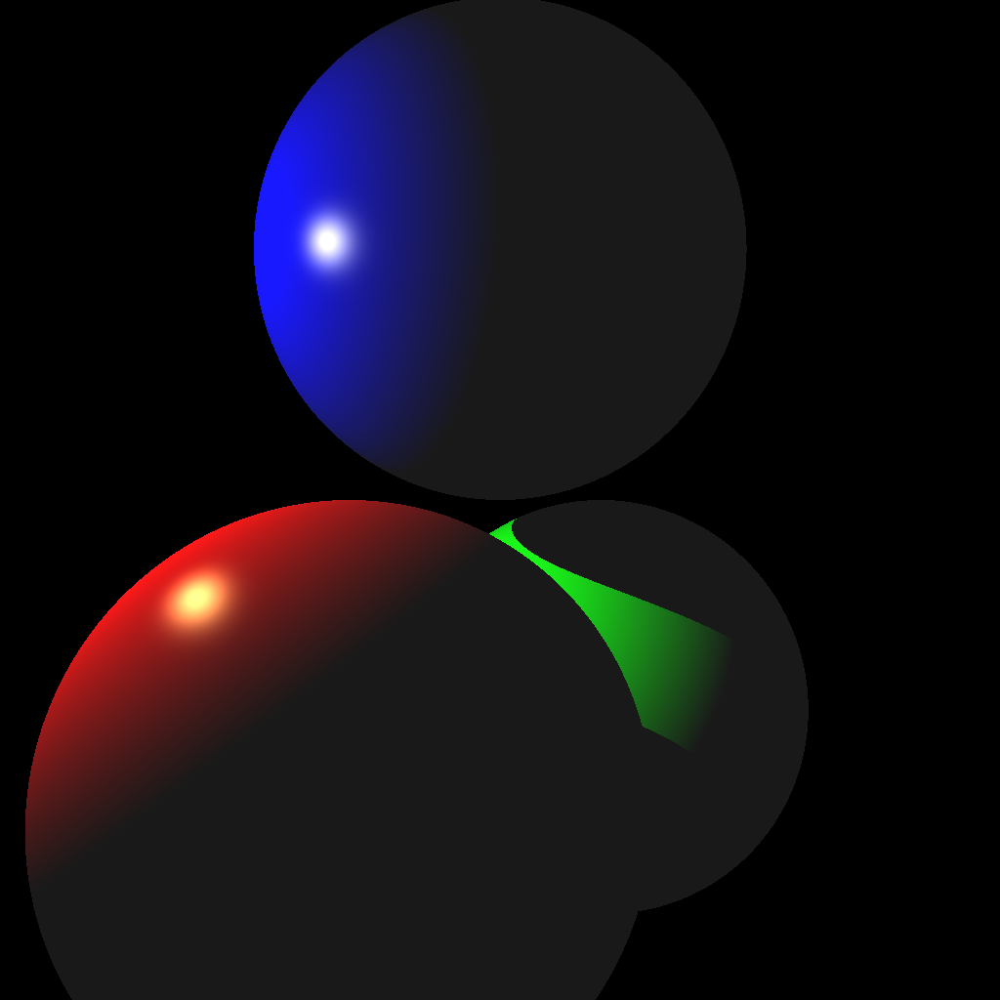
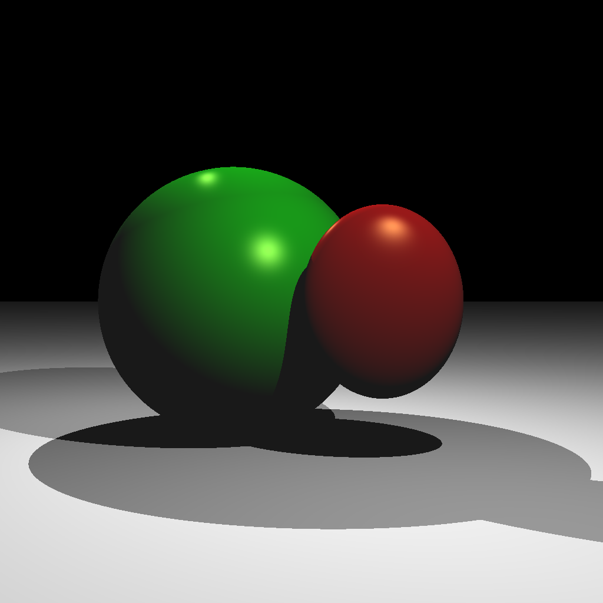
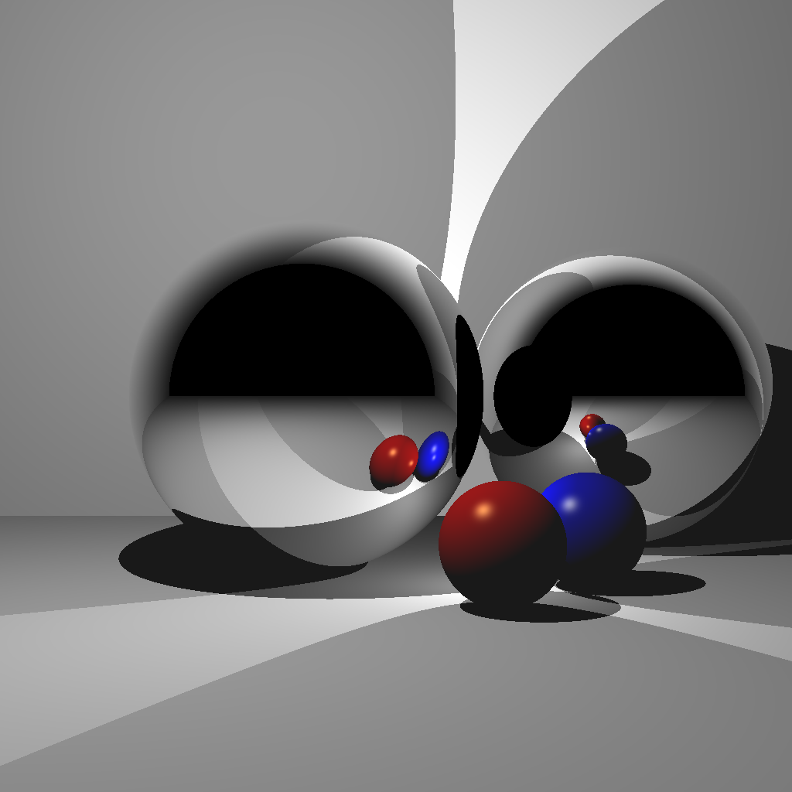
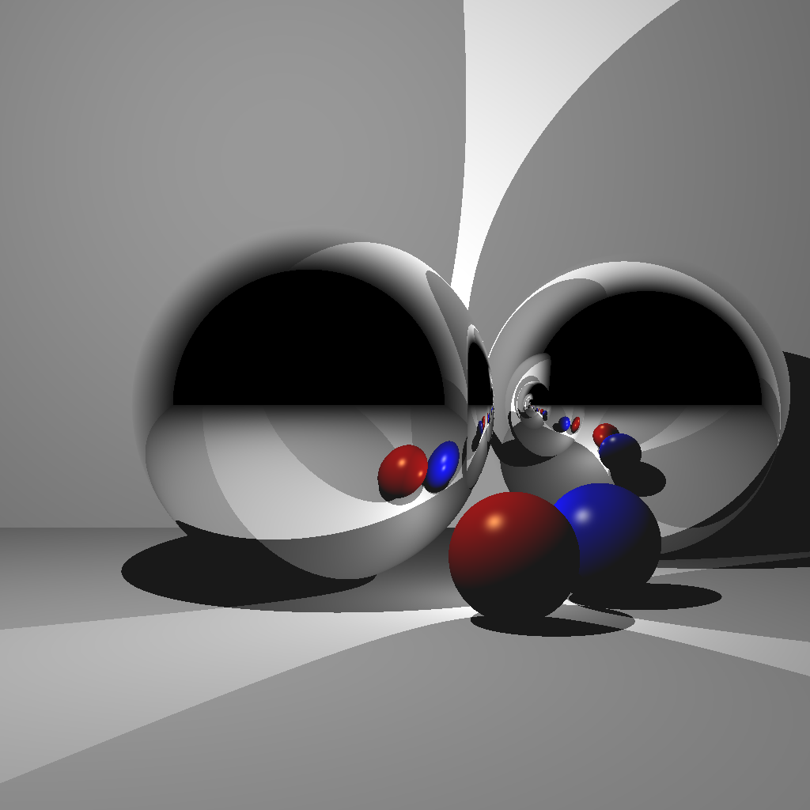
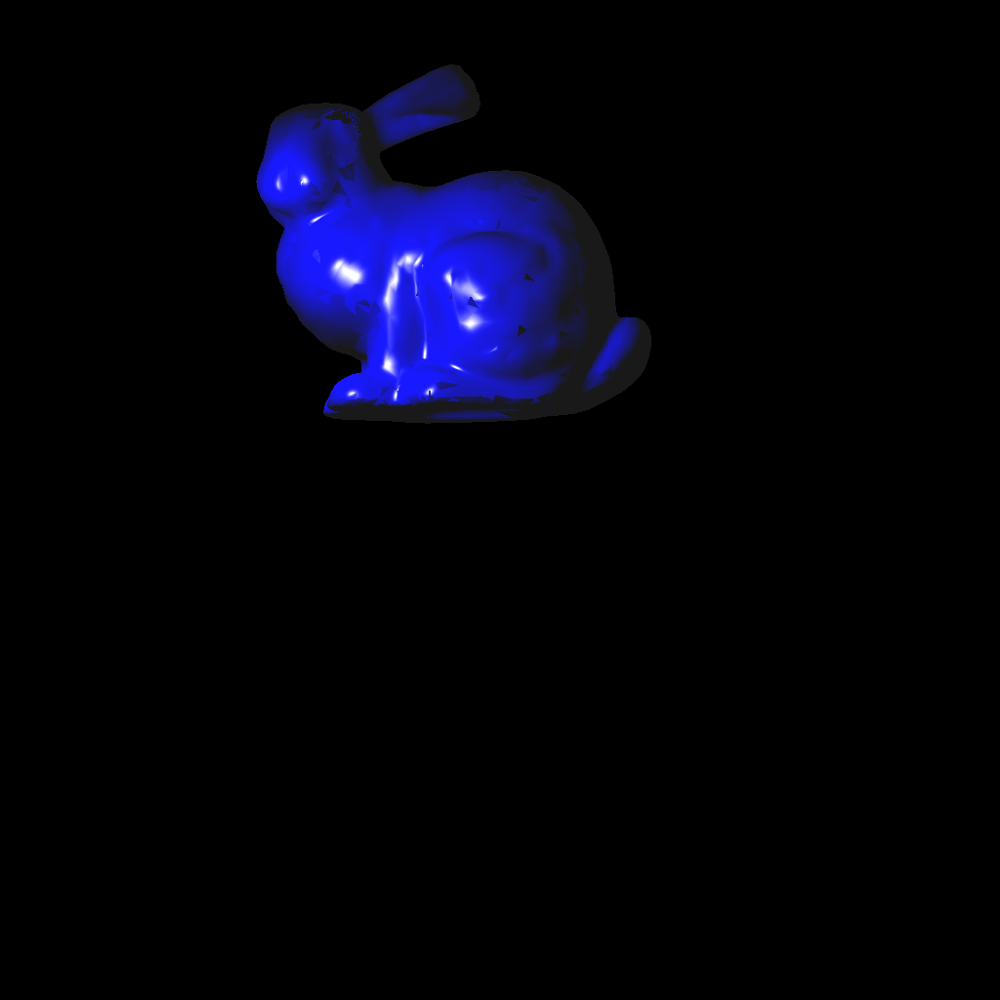
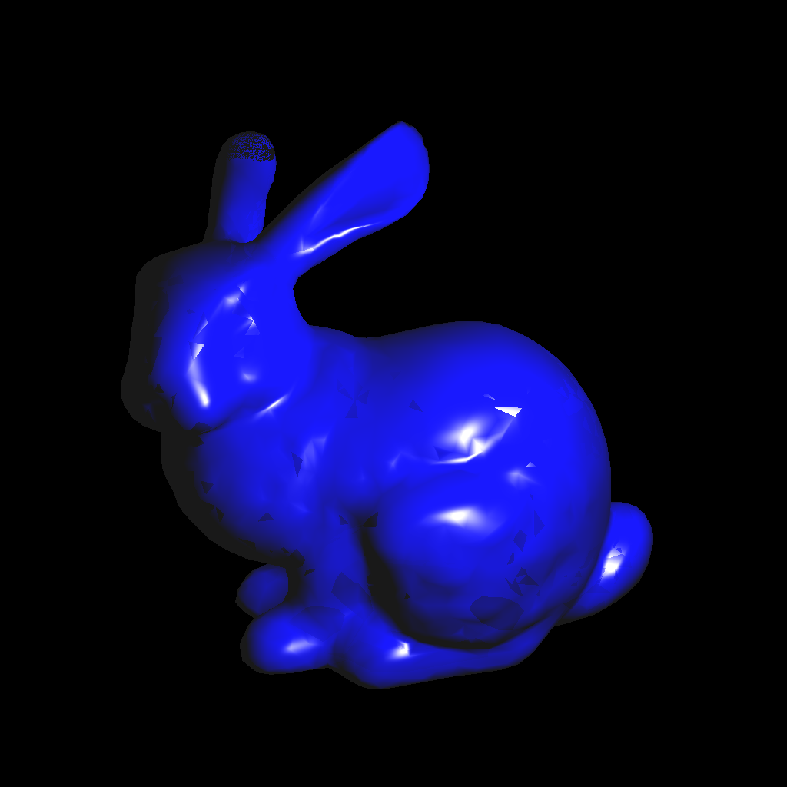
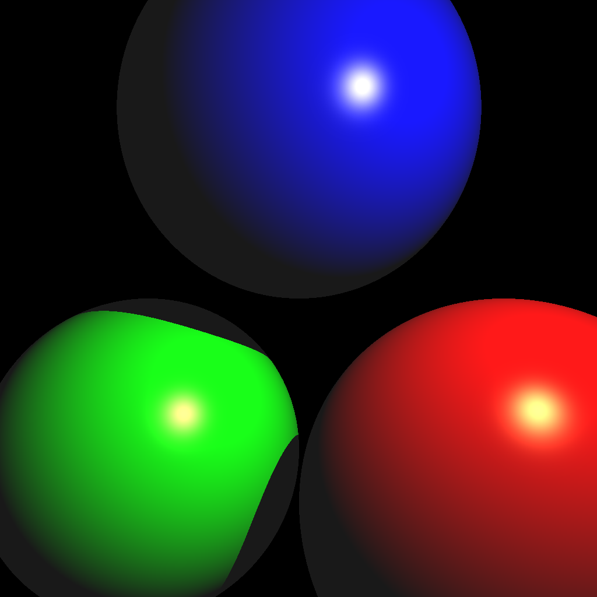
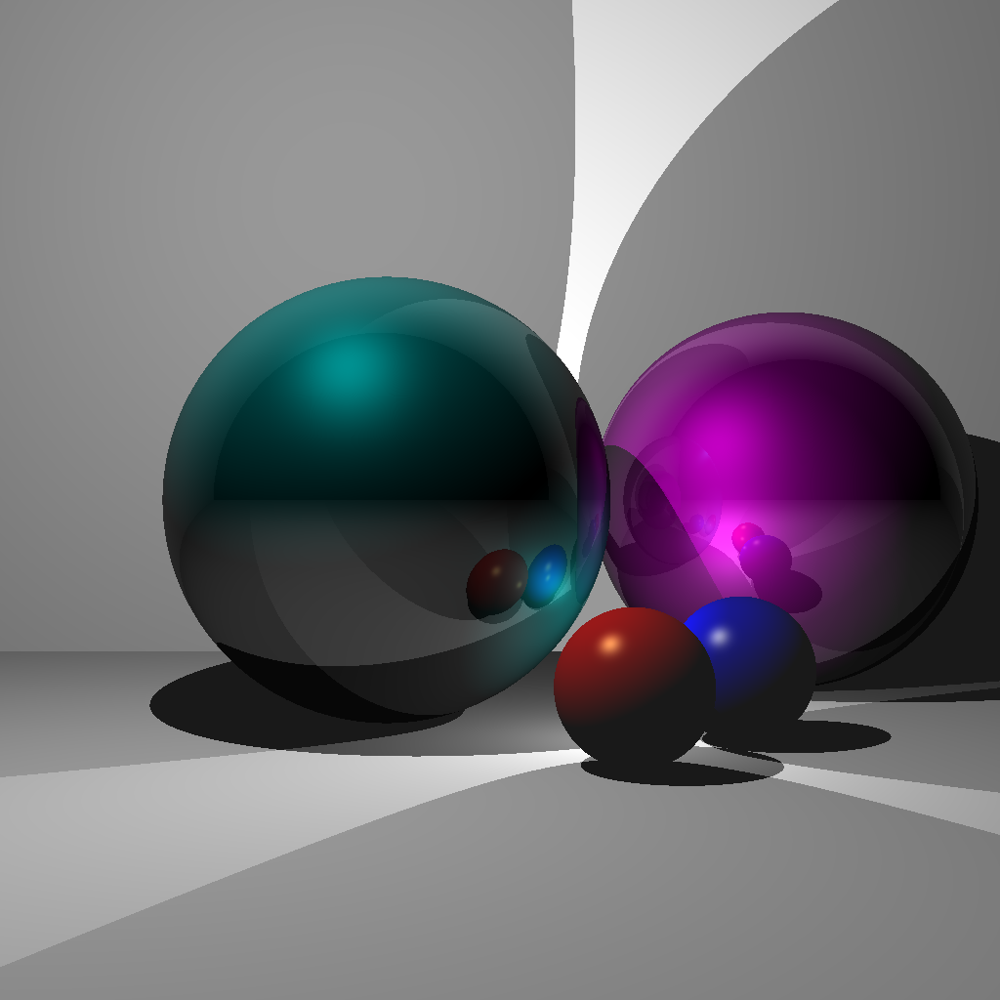
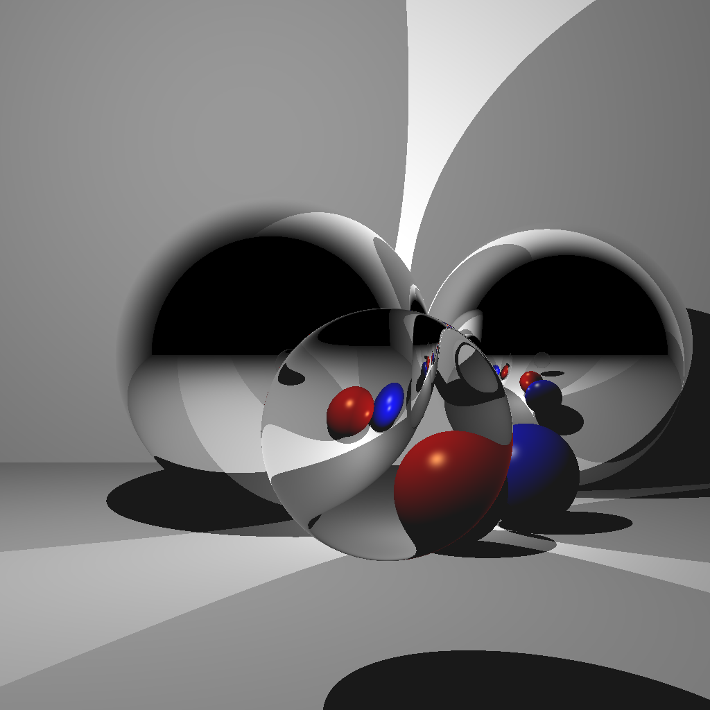
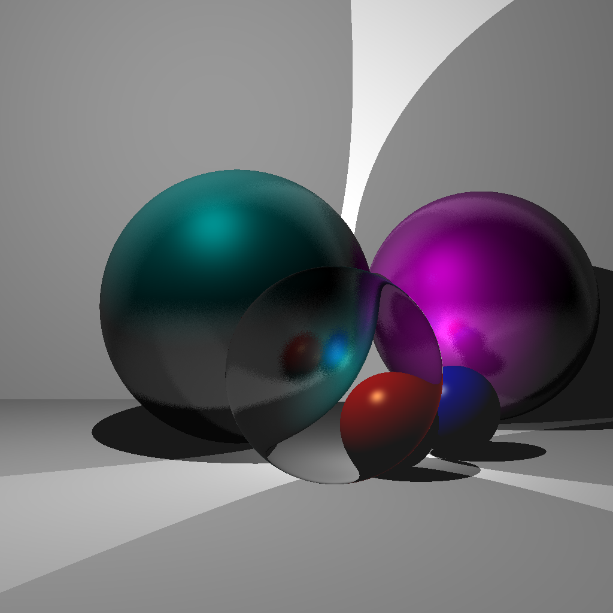

# C++ Raytracer / Software Rasterizer

Artifacts from .gif format

this code is really gross and kinda broken for objs files, i want to go back to refactor and expand on this at some point + some shading is wrong on obj files

for best results use a res of >= 256 pixels, 
its multithreaded so they dont take too long

to run
./A6 [scene num] [image size] [output filename]
output filename doesn't need '.png', it's added

## scene 1/2

3 spheres with one light

## scene 3

ellipse with sphere + multiple light sources

## scene 4

single depth reflection

## scene 5

mutli depth reflection

## scene 6

default bunny

## scene 7

transformed bunny

## scene 8

scenes 1/2 transformed!

## scene 9

blinn phong reflective surfaces

## scene 10

blinn phong rough (reflection blending) reflective surfaces

## scene 11

refraction + prev

## scene 12

more refraction + prev

## scene 13

gif output of rolling glass ball

