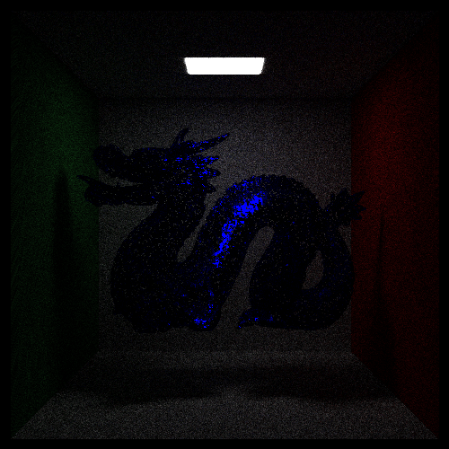
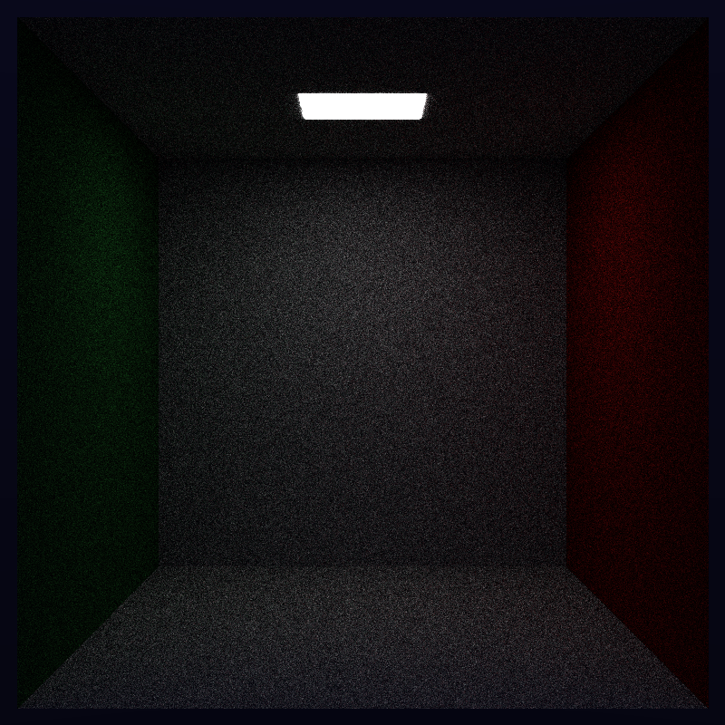
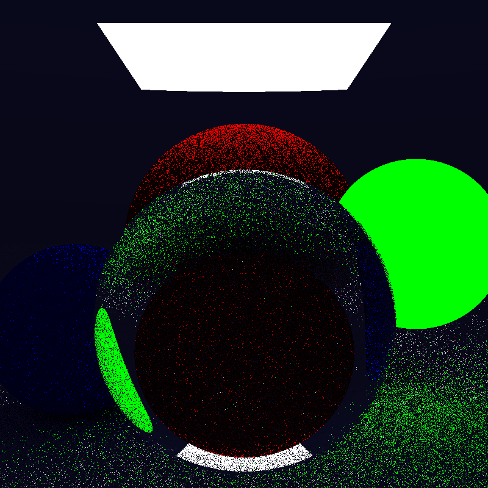
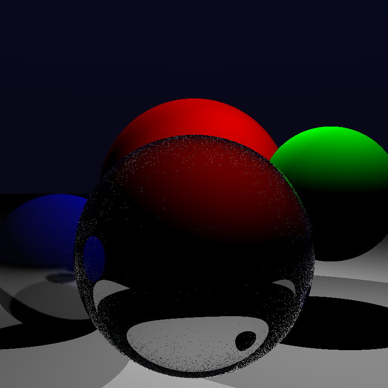
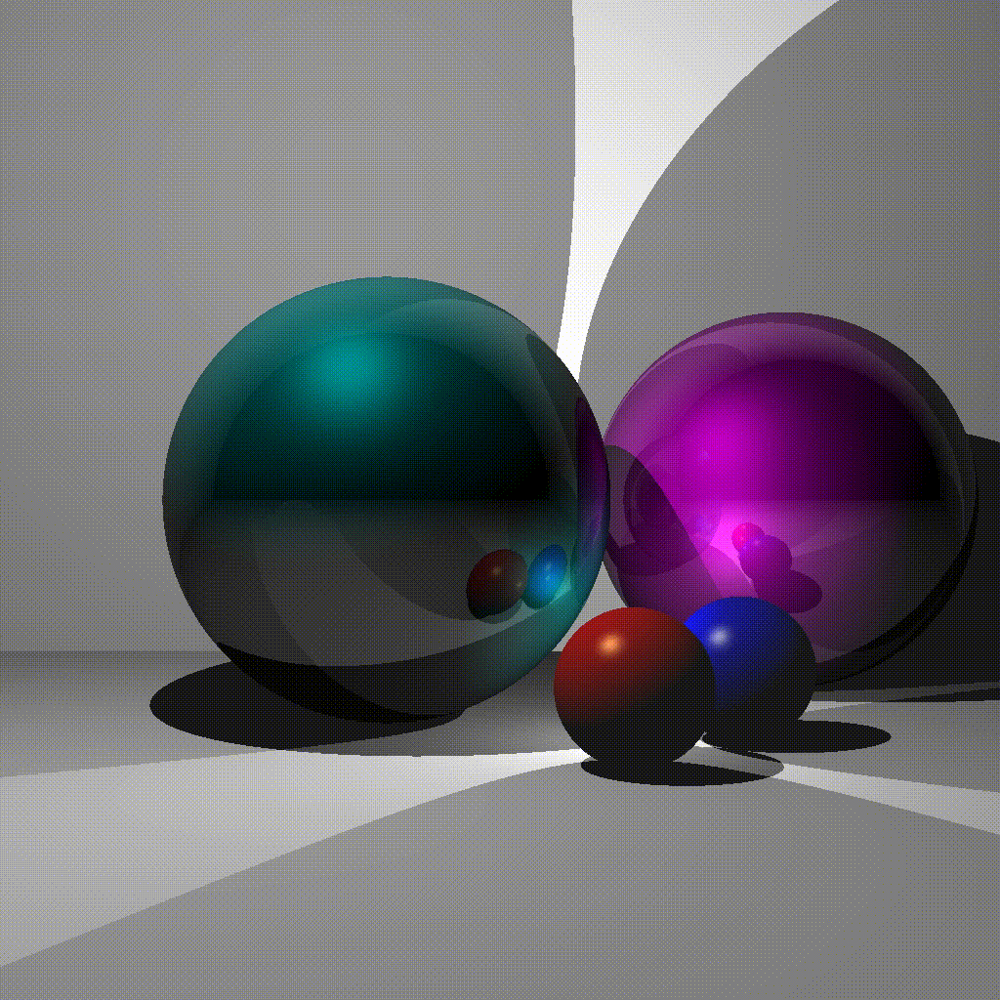
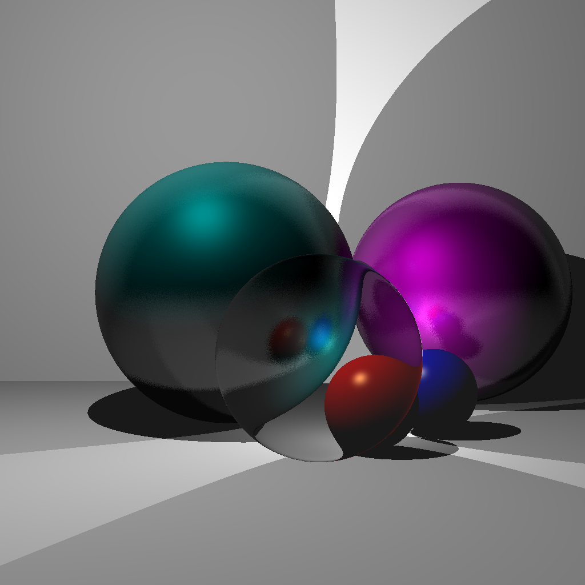

# C++ Raytracer

Fixing up some old, basic ray tracing code with hopes to build out a decent ray tracer with some guidance from PBRT and move to the gpu at some point.

to run
./RT [image size] [output filename]
output filename doesn't need extension

# new

# old 

rolling glass ball

roughness w/ refraction & reflection

